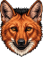
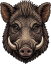

```{=html}
<a class="skip-link" href="#conteudo">Pular para o conteúdo</a>

<!-- ============================= HERÓI =============================
     O herói é a esteira. Não há ilustração: o que ocupa a dobra é o próprio
     diagrama de fluxo — planilha → ObservaBio → dados validados — com as
     correntes de pixels entrando por uma borda da tela e saindo pela outra.
     Os campos são campos reais de uma planilha e o que sai de cada um é o que
     o app devolve de fato. -->
<header class="hero">
  <!-- Nome, natureza e as duas ações, nada mais. Quem explica o produto é a
       esteira logo abaixo: repetir isso em prosa custaria altura que ela usa
       melhor. -->
  <div class="wrap hero-head" id="conteudo">
    <h1 class="hero-title">Observa<span class="accent">Bio</span></h1>
    <span class="eyebrow">Aplicativo R/Shiny · PT-BR</span>
    <div class="hero-actions">
      <!-- CTA-APP — o app publicado no Posit Connect Cloud. A URL vem da conta
           e do nome do conteúdo: republicar por outra conta muda o endereço.
           Passo a passo em docs/manutencao.md, seção 5.3. -->
      <a class="btn btn-primary" href="https://obsbio-observabio.share.connect.posit.cloud/">Abrir o ObservaBio</a>
      <a class="btn btn-ghost" href="#distribuicao">Ver como funciona</a>
    </div>
  </div>

  <!-- A faixa da esteira sangra até as bordas da tela. O canvas cobre esta
       faixa inteira, e não só a coluna de texto: as correntes entram por fora
       do papel e saem por fora do papel. Os cartões ficam acima do canvas, e
       cada pixel some atrás do cartão por onde passa. -->
  <div class="pipe-bleed">
    <div class="hero-flow" aria-hidden="true"></div>

    <div class="wrap pipe">
      <div class="pipe-labels">
        <span class="pipe-label">Sua planilha</span>
        <span class="pipe-arrow" aria-hidden="true">→</span>
        <span class="pipe-label pipe-label-core">ObservaBio</span>
        <span class="pipe-arrow" aria-hidden="true">→</span>
        <span class="pipe-label">Dados validados</span>
      </div>

      <div class="pipe-grid">

        <div class="pipe-core">
          <span class="core-name">Observa<span class="accent">Bio</span></span>
          <ul class="core-ops">
            <li>resolve o nome</li>
            <li>cruza o status</li>
            <li>confere o lugar</li>
            <li>aponta invasoras</li>
          </ul>
        </div>

        <div class="pipe-row">
          <div class="cell cell-in">
            <span class="cell-k">nome da espécie</span>
            <span class="cell-stack">
              <span class="frame frame-a">
                <span class="cell-v">lobo guara</span>
              </span>
              <span class="frame frame-b">
                <span class="cell-v">javali</span>
              </span>
            </span>
          </div>
          <span class="wire wire-in" aria-hidden="true"><i class="spark"></i></span>
          <span class="wire wire-out" aria-hidden="true"><i class="spark"></i></span>
          <div class="cell cell-out">
            <span class="cell-k">nome científico validado</span>
            <span class="cell-stack">
              <span class="frame frame-a">
                <span class="cell-v">
                  <span class="sci">Chrysocyon brachyurus</span>
                  <span class="auth">(Illiger, 1815)</span>
                </span>
                <span class="cell-src">Fauna do Brasil</span>
              </span>
              <span class="frame frame-b">
                <span class="cell-v">
                  <span class="sci">Sus scrofa</span>
                  <span class="auth">Linnaeus, 1758</span>
                </span>
                <span class="cell-src">Fauna do Brasil</span>
              </span>
            </span>
          </div>
        </div>

        <div class="pipe-row">
          <div class="cell cell-in">
            <span class="cell-k">status de conservação</span>
            <span class="cell-v cell-empty">não informado</span>
          </div>
          <span class="wire wire-in" aria-hidden="true"><i class="spark"></i></span>
          <span class="wire wire-out" aria-hidden="true"><i class="spark"></i></span>
          <div class="cell cell-out">
            <span class="cell-k">status de conservação</span>
            <span class="cell-stack">
              <span class="frame frame-a">
                <span class="cell-v"><span class="chip chip-warning">VU</span> vulnerável</span>
                <span class="cell-src">MMA · Portaria 1.704/2026</span>
              </span>
              <span class="frame frame-b">
                <span class="cell-v"><span class="chip chip-muted">não consta da lista</span></span>
                <span class="cell-src cell-src-muted">MMA · IUCN</span>
              </span>
            </span>
          </div>
        </div>

        <div class="pipe-row" data-alert="a">
          <div class="cell cell-in">
            <span class="cell-k">área do estudo</span>
            <span class="cell-stack">
              <span class="frame frame-a"><span class="cell-v">Amazônia · Amazonas</span></span>
              <span class="frame frame-b"><span class="cell-v">Cerrado · Minas Gerais</span></span>
            </span>
          </div>
          <span class="wire wire-in" aria-hidden="true"><i class="spark"></i></span>
          <span class="wire wire-out" aria-hidden="true"><i class="spark"></i></span>
          <div class="cell cell-out">
            <span class="cell-k">verificação geográfica</span>
            <span class="cell-stack">
              <span class="frame frame-a">
                <span class="cell-v"><span class="chip chip-warning">fora da distribuição</span></span>
                <span class="cell-src cell-src-alert">GBIF · buffer de 10 km</span>
              </span>
              <span class="frame frame-b">
                <span class="cell-v"><span class="chip chip-success">ocorrência compatível</span></span>
                <span class="cell-src">GBIF · buffer de 10 km</span>
              </span>
            </span>
          </div>
        </div>

        <div class="pipe-row" data-alert="b">
          <div class="cell cell-in">
            <span class="cell-k">espécie exótica</span>
            <span class="cell-v cell-empty">não informado</span>
          </div>
          <span class="wire wire-in" aria-hidden="true"><i class="spark"></i></span>
          <span class="wire wire-out" aria-hidden="true"><i class="spark"></i></span>
          <div class="cell cell-out">
            <span class="cell-k">listas de invasoras</span>
            <span class="cell-stack">
              <span class="frame frame-a">
                <span class="cell-v"><span class="chip chip-muted">não consta das listas</span></span>
                <span class="cell-src cell-src-muted">Hórus · GRIIS · UCs federais</span>
              </span>
              <span class="frame frame-b">
                <span class="cell-v"><span class="chip chip-error">exótica invasora</span></span>
                <span class="cell-src cell-src-error">Hórus · GRIIS · UCs federais</span>
              </span>
            </span>
          </div>
        </div>

      </div>

      <p class="footnote">
        A esteira alterna entre dois registros da mesma planilha: um nativo
        ameaçado, um exótico invasor.
      </p>
    </div>
  </div>

  <p class="sr-only">
    Quatro correntes de pixels entram pela borda esquerda da tela, uma para cada
    campo da planilha — nome da espécie, status de conservação, área do estudo e
    espécie exótica. Cada corrente atravessa o cartão do seu campo, e as quatro
    convergem num ponto só na borda do núcleo do ObservaBio. Do outro lado os
    mesmos pixels voltam a se abrir em leque, já na cor do veredicto: verde
    quando uma base oficial respondeu, âmbar no alerta de distribuição, vermelho
    na espécie exótica invasora. Nada é emitido à direita que não tenha entrado
    pela esquerda. Os pixels saem da tela pela borda direita.
  </p>
</header>

<!-- ============================= NÚMEROS ============================= -->
<section class="band band-stats">
  <div class="wrap stats">
    <div class="stat">
      <span class="stat-n">3</span>
      <span class="stat-l">bases oficiais e internacionais</span>
    </div>
    <div class="stat">
      <span class="stat-n">10 km</span>
      <span class="stat-l">raio de verificação geográfica</span>
    </div>
    <div class="stat">
      <span class="stat-n">2</span>
      <span class="stat-l">planilhas de dados e auditoria</span>
    </div>
  </div>
</section>

<!-- ============================= DISTRIBUIÇÃO ============================= -->
<section class="band band-sunken" id="distribuicao">
  <div class="wrap geo-grid">

    <div class="geo-text">
      <span class="eyebrow">Verificação geográfica</span>
      <h2>A espécie faz sentido <em>onde</em> você diz que ela está?</h2>
      <p>
        O ObservaBio traça um raio de 10 km em torno da área de estudo, busca
        ocorrências registradas no GBIF dentro dele e confronta o resultado com a
        distribuição conhecida por estado e bioma. Disso sai o
        <code>distributionFlag</code>.
      </p>

      <ul class="flags">
        <li class="flag flag-success">
          <span class="flag-k">confirmada</span>
          <span class="flag-v">registro do GBIF a menos de 10 km</span>
        </li>
        <li class="flag flag-info">
          <span class="flag-k">sem registro próximo</span>
          <span class="flag-v">mas a espécie ocorre no estado ou no bioma</span>
        </li>
        <li class="flag flag-warning">
          <span class="flag-k">fora da distribuição</span>
          <span class="flag-v">sem registro no estado ou bioma — possível erro de identificação</span>
        </li>
        <li class="flag flag-muted">
          <span class="flag-k">sem dados</span>
          <span class="flag-v">não há informação suficiente para avaliar</span>
        </li>
      </ul>

      <p class="callout">
        O <code>distributionFlag</code> é um <strong>alerta, não um veredito</strong>.
        Ele aponta o registro que merece uma segunda olhada; quem decide é quem
        conhece o campo.
      </p>
    </div>

    <figure class="geo-fig">
      <div class="geo-art">
        <!-- pixel:buffer:start -->
<svg xmlns="http://www.w3.org/2000/svg" viewBox="0 0 40 40" shape-rendering="crispEdges" class="sprite sprite-buffer" role="presentation" aria-hidden="true"><g fill="var(--pel-coat)"><rect x="11" y="12" width="1" height="1"/><rect x="27" y="15" width="1" height="1"/><rect x="13" y="24" width="1" height="1"/><rect x="24" y="27" width="1" height="1"/><rect x="35" y="33" width="1" height="1"/></g><g fill="var(--pel-area)"><rect x="17" y="17" width="6" height="1"/><rect x="16" y="18" width="8" height="1"/><rect x="16" y="19" width="9" height="1"/><rect x="15" y="20" width="9" height="1"/><rect x="16" y="21" width="7" height="1"/><rect x="17" y="22" width="5" height="1"/></g><g fill="var(--pel-buffer)"><rect x="16" y="3" width="2" height="1"/><rect x="19" y="3" width="2" height="1"/><rect x="22" y="3" width="2" height="1"/><rect x="15" y="4" width="1" height="1"/><rect x="25" y="4" width="1" height="1"/><rect x="12" y="5" width="1" height="1"/><rect x="27" y="5" width="1" height="1"/><rect x="10" y="6" width="2" height="1"/><rect x="29" y="6" width="1" height="1"/><rect x="9" y="7" width="1" height="1"/><rect x="31" y="7" width="1" height="1"/><rect x="8" y="8" width="1" height="1"/><rect x="32" y="8" width="1" height="1"/><rect x="7" y="9" width="1" height="1"/><rect x="6" y="10" width="1" height="1"/><rect x="34" y="10" width="1" height="1"/><rect x="6" y="11" width="1" height="1"/><rect x="5" y="12" width="1" height="1"/><rect x="35" y="12" width="1" height="1"/><rect x="36" y="14" width="1" height="1"/><rect x="4" y="15" width="1" height="1"/><rect x="3" y="16" width="1" height="1"/><rect x="37" y="16" width="1" height="1"/><rect x="3" y="17" width="1" height="1"/><rect x="37" y="18" width="1" height="1"/><rect x="3" y="19" width="1" height="1"/><rect x="37" y="19" width="1" height="1"/><rect x="3" y="20" width="1" height="1"/><rect x="37" y="21" width="1" height="1"/><rect x="3" y="22" width="1" height="1"/><rect x="37" y="22" width="1" height="1"/><rect x="3" y="23" width="1" height="1"/><rect x="37" y="24" width="1" height="1"/><rect x="4" y="25" width="1" height="1"/><rect x="36" y="25" width="1" height="1"/><rect x="36" y="26" width="1" height="1"/><rect x="5" y="27" width="1" height="1"/><rect x="35" y="27" width="1" height="1"/><rect x="6" y="29" width="1" height="1"/><rect x="34" y="30" width="1" height="1"/><rect x="7" y="31" width="1" height="1"/><rect x="33" y="31" width="1" height="1"/><rect x="8" y="32" width="1" height="1"/><rect x="32" y="32" width="1" height="1"/><rect x="31" y="33" width="1" height="1"/><rect x="10" y="34" width="1" height="1"/><rect x="30" y="34" width="1" height="1"/><rect x="12" y="35" width="1" height="1"/><rect x="27" y="35" width="1" height="1"/><rect x="14" y="36" width="1" height="1"/><rect x="25" y="36" width="2" height="1"/><rect x="16" y="37" width="1" height="1"/><rect x="18" y="37" width="2" height="1"/><rect x="21" y="37" width="2" height="1"/><rect x="24" y="37" width="1" height="1"/></g></svg>
<!-- pixel:buffer:end -->
      </div>
      <figcaption>
        <ul class="legend">
          <li><span class="sw sw-area"></span>área de estudo</li>
          <li><span class="sw sw-buffer"></span>buffer de 10 km</li>
          <li><span class="sw sw-occ"></span>ocorrência no GBIF</li>
        </ul>
        <p class="geo-example">
          <span class="sci">Chrysocyon brachyurus</span> ocorre em 17 estados —
          o Amazonas não é um deles. Declarado lá, o registro sai marcado
          <span class="chip chip-warning">fora da distribuição</span>.
        </p>
      </figcaption>
    </figure>

  </div>
</section>

<!-- ============================= SAÍDA ============================= -->
<section class="band" id="saida">
  <div class="wrap">
    <div class="section-head">
      <span class="eyebrow">O que você leva</span>
      <h2>Dois arquivos: um para publicar, outro para responder.</h2>
    </div>

    <div class="outputs">
      <article class="output">
        <h3>Dados validados</h3>
        <p>
          A sua planilha de volta, com os nomes aceitos, os autores, a
          classificação e o status de conservação preenchidos nas colunas do
          Darwin Core. É esse arquivo que segue para o SiBBr, para o GBIF ou
          para o relatório.
        </p>
      </article>
      <article class="output">
        <h3>Auditoria</h3>
        <p>
          O rastro de como cada linha chegou ali: o nome enviado, o nome aceito,
          a base que respondeu, o tipo de correspondência e o alerta de
          distribuição. É o que permite alguém conferir você.
        </p>
      </article>
    </div>
  </div>
</section>

<!-- ============================= RODAPÉ ============================= -->
<footer class="site-footer">
  <div class="wrap footer-grid">
    <div class="footer-brand">
      <p class="footer-name">Observa<span class="accent">Bio</span></p>
      <p class="footer-tag">Validação de listas de espécies</p>
    </div>
    <nav class="footer-links" aria-label="Fontes de dados">
      <span class="footer-label">Fontes</span>
      <a href="https://floradobrasil.jbrj.gov.br">Flora do Brasil</a>
      <a href="http://fauna.jbrj.gov.br">Fauna do Brasil</a>
      <a href="https://www.gbif.org">GBIF</a>
      <a href="https://institutohorus.org.br">Instituto Hórus</a>
      <a href="https://griis.org">GRIIS</a>
      <a href="https://dwc.tdwg.org">Darwin Core</a>
      <a href="https://www.sibbr.gov.br">SiBBr</a>
    </nav>
  </div>

  <!-- Ficha de créditos: três itens numa faixa só, centralizada. Os papéis são
       distintos e ficam separados de propósito — quem realiza não é quem
       desenvolve, e a licença não é nem uma coisa nem outra. Cada crédito é um
       bloco próprio para que a quebra em tela estreita caia entre eles, nunca
       entre um rótulo e o seu conteúdo. O wordmark do Observatório já vem em marfim
       (data-raw/prep_logo.py); o do iHumanize é arte preta e é invertido no
       CSS, como no rodapé da trilha do app. -->
  <div class="wrap footer-credits">
    <div class="footer-credit">
      <span class="footer-label">Realização</span>
      <div class="footer-logos">
        
        
      </div>
    </div>

    <div class="footer-credit">
      <span class="footer-label">Licença</span>
      <p class="footer-credit-value">
        <a href="https://www.gnu.org/licenses/gpl-3.0.html">GPL-3</a>
      </p>
    </div>

    <div class="footer-credit">
      <span class="footer-label">Desenvolvimento</span>
      <p class="footer-credit-value">
        <a href="https://github.com/rogerio-onza">Rogério Nunes Oliveira</a>
      </p>
    </div>
  </div>
</footer>
```
